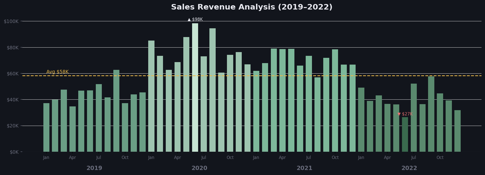
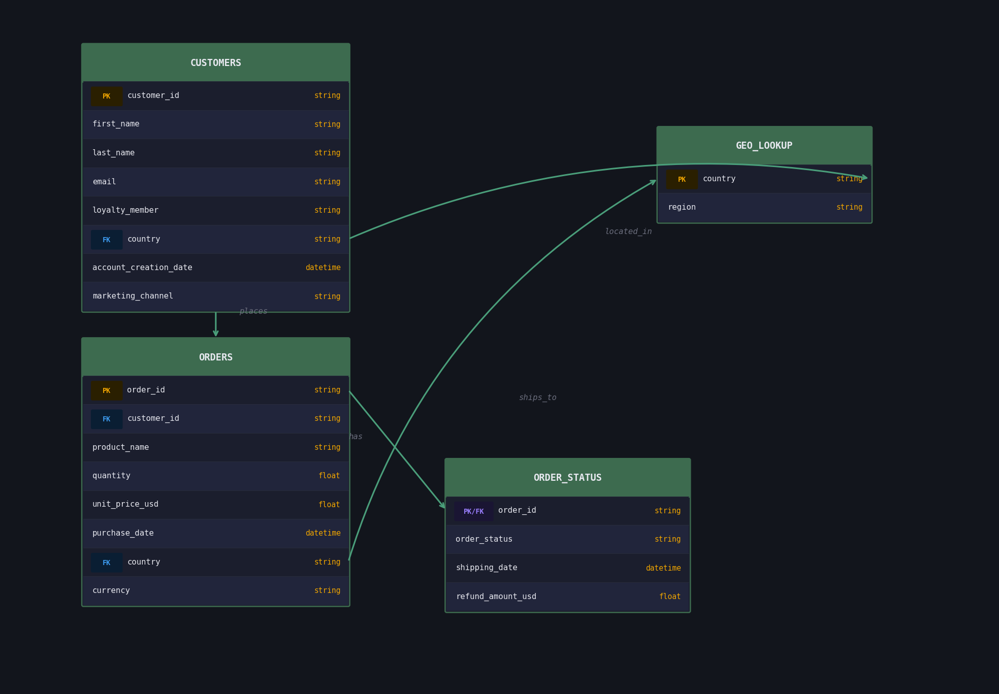
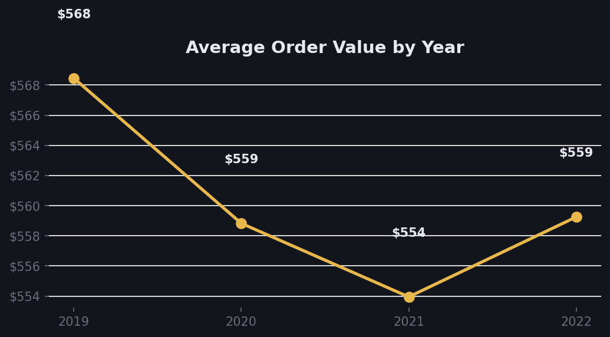
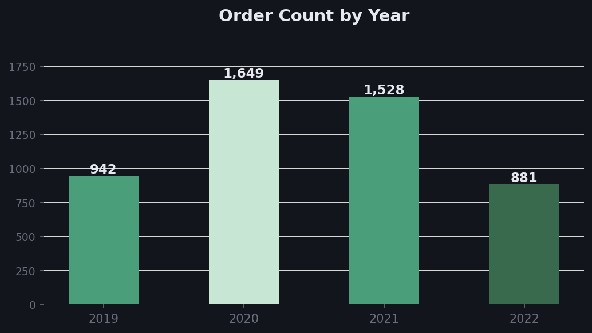
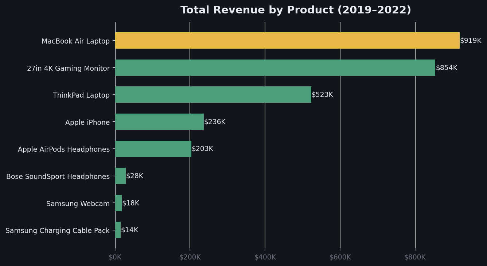
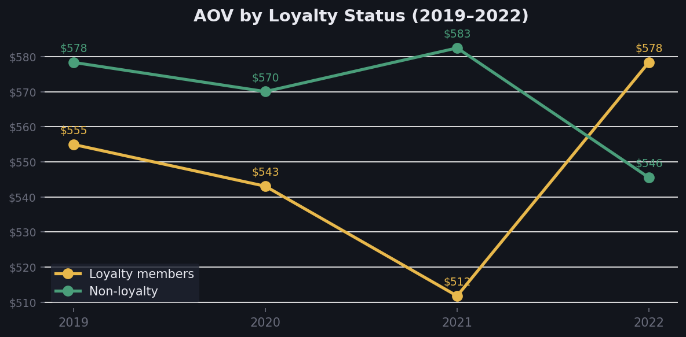
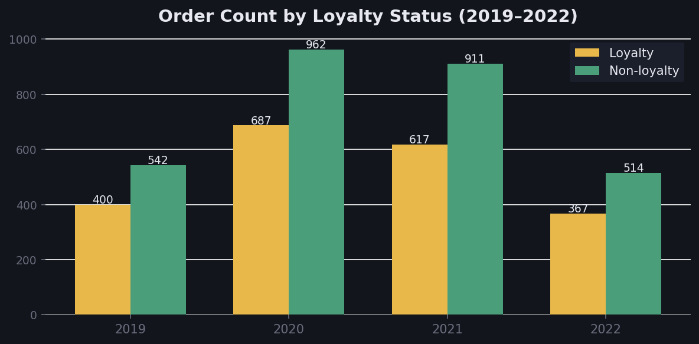
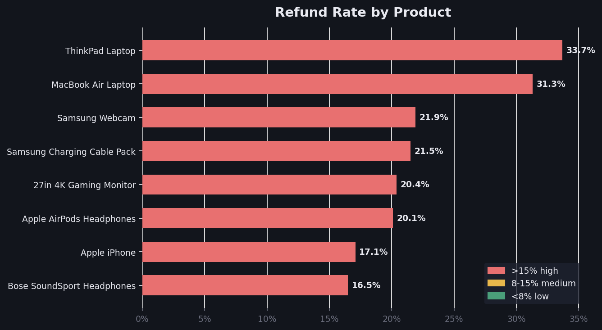
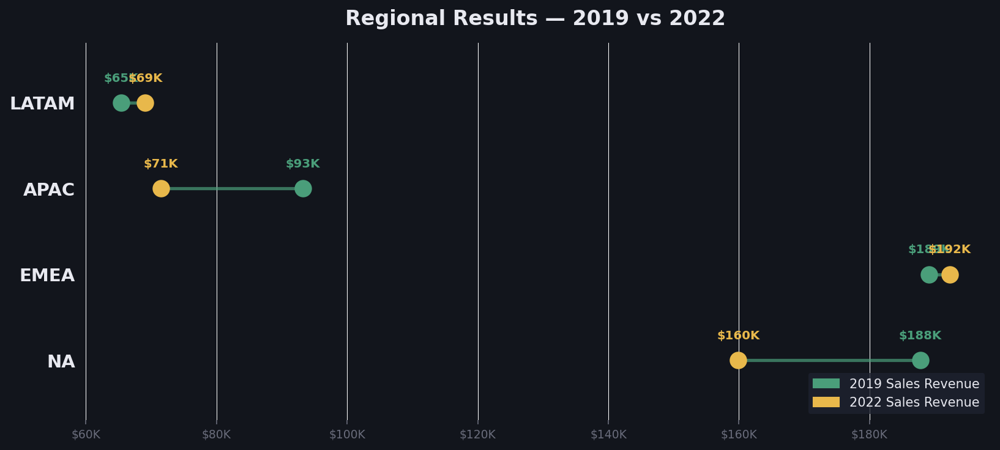

<h1 align="center">Ecommerce Performance Report</h1>

<table align="center">
  <tr>
    <td width="1440">
      <h2 align="center">Client Background</h2>
      

        <strong>Nomad</strong> is a US-based e-commerce company that sells popular consumer electronics and accessories to a global clientele. Established in 2018, the company has grown and expanded in the last few years, encountering increasing competition from peer companies as well as unique challenges and opportunities brought on by the COVID-19 pandemic.
      

      

        <strong>Nomad's</strong> book of business consists of <strong>1,000</strong> customers and possesses over <strong>5,000</strong> transactions, generating sales revenue across four years of operation. The available eCommerce data spans various dimensions and metrics, including sales, products, sales by regions, and the company's loyalty program.
      

      

        Reporting to the Head of Operations, an in-depth analysis was conducted to evaluate <strong>Nomad's</strong> performance over the past several years (2019–2022). This comprehensive review provides valuable insights that internal cross-functional teams will utilize to streamline processes and enhance <strong>Nomad's</strong> commercial performance.
      

      <h3>Northstar Metrics</h3>
      <ul>
        <li>Sales trends — Focusing on key metrics of sales revenue, number of orders placed, and average order value (AOV).</li>
        <li>Product performance — Analyzing different product lines, market impact, and refund rates to inform strategic product decisions.</li>
        <li>Loyalty program evaluation — Evaluating the effectiveness of the company's loyalty program and providing recommendations to maximize customer engagement and retention.</li>
        <li>Regional results — Evaluating regional demand and product performance within regions to identify areas for improvement.</li>
      </ul>
    </td>
  </tr>
</table>

<h1 align="center">Executive Summary</h1>
<h3 align="center">Sales Revenue Analysis (2019–2022)</h3>

  

<table align="center">
  <tr>
    <td width="460" valign="top">
      <ol>
        <li><strong>Revenue Growth and Peak Performance</strong>
          <ul>
            <li>2020 was the strongest year, with sales consistently growing each quarter as a result of the COVID-19 pandemic.</li>
            <li>Q4 2020 saw the highest revenue, making it the best-performing period across all four years.</li>
            <li>Early 2021 also maintained strong sales, though a downward trend began shortly afterward.</li>
          </ul>
        </li>
        <li><strong>Declining Trend in 2022</strong>
          <ul>
            <li>A significant sales decline occurred in 2022, particularly in Q3 and Q4, marking the lowest revenue months across the entire period.</li>
            <li>The decline suggests a major downturn, likely caused by external market conditions, reduced consumer demand, or internal operational shifts.</li>
          </ul>
        </li>
      </ol>
    </td>
    <td width="460" valign="top">
      <ol start="3">
        <li><strong>Quarterly Insights & Seasonal Trends</strong>
          <ul>
            <li>Q3 and Q4 of each year typically show strong performance due to seasonal shopping trends and holiday marketing.</li>
            <li>Q1 2022 started reasonably well but revenue quickly dropped, signaling overall weak performance.</li>
          </ul>
        </li>
        <li><strong>Key Takeaways & Recommendations</strong>
          <ul>
            <li>Investigate the causes of the 2022 decline (e.g., market changes, competition, internal factors).</li>
            <li>Leverage high-performing Q3/Q4 periods to refine marketing and sales strategies.</li>
            <li>Reassess business strategy for 2023, focusing on pricing, promotions, and customer engagement.</li>
          </ul>
        </li>
      </ol>
    </td>
  </tr>
</table>

<h2 align="center">Dataset Structure and ERD (Entity relationship diagram)</h2>

The database structure consists of four tables: orders, customers, geo_lookup, and order_status, with a total row count of 6,017 records.

  

<h1 align="center">Insights Deep-Dive</h1>

<h1 align="center">Sales Trend</h1>

<table align="center">
  <tr>
    <td width="480" align="center">
      <h3>Average Order Value by Year</h3>
      
    </td>
    <td width="480" align="center">
      <h3>Order Count by Year</h3>
      
    </td>
  </tr>
</table>

<table>
  <tr>
    <td>
      <strong>Sales Revenue</strong>
      <ol>
        <li>Sharp Decline in Q4 2022 – A Major Sales Anomaly
          <ul>
            <li>Historically, Q4 (Oct-Dec) has been the strongest quarter due to holiday shopping. However, in 2022, <strong>Q4 sales plummeted</strong>.</li>
            <li>2022 revenue was significantly lower across all quarters compared to the 2020 peak, representing a <strong>~30-40% drop</strong> in order volume year over year.</li>
          </ul>
        </li>
        <li>Post-Pandemic Sales Normalization (2020-2022 Trends)
          <ul>
            <li>2020 Sales Surge: The pandemic led to a significant boost in eCommerce sales — <strong>Q4 2020 was nearly double Q4 2019</strong>.</li>
            <li>2021 Slight Slowdown: Sales remained high but started stabilizing.</li>
            <li>2022 Major Decline: A <strong>consistent drop in sales across all quarters</strong> suggests a post-pandemic correction.</li>
          </ul>
        </li>
      </ol>
      <strong>Average Order Value</strong>
      <ol>
        <li>AOV peaked in 2020 and declined steadily through 2021–2022, returning close to 2019 levels.</li>
        <li>AOV is <strong>not</strong> the primary driver of the 2022 revenue decline — order count is.</li>
      </ol>
      <strong>Order Count</strong>
      <ol>
        <li>Order counts closely follow revenue. The decline is primarily due to <strong>fewer orders</strong>, not lower AOV.</li>
        <li>The anomaly started in <strong>mid-2022</strong>, with order volume falling sharply through Q3 and Q4.</li>
      </ol>
    </td>
  </tr>
</table>

<h1 align="center">Product Performance</h1>
<h3 align="center">Product Sales Surged in 2020 but were not Sustained at High Levels</h3>

  

<table align="center">
  <tr>
    <td width="333" valign="top">
      <h3>The Best and Worst</h3>
      <ul>
        <li>The <strong>27in 4K Gaming Monitor</strong> is the highest revenue generating product overall.</li>
        <li><strong>Apple AirPods Headphones</strong> and <strong>MacBook Air Laptop</strong> rank 2nd and 3rd.</li>
        <li><strong>Bose SoundSport Headphones</strong> had near-zero orders across all years.</li>
        <li><strong>Apple iPhone</strong> is among the lowest performers despite brand recognition.</li>
      </ul>
    </td>
    <td width="333" valign="top">
      <h3>AOV Over Time</h3>
      <ul>
        <li>AOV peaked in 2020 then declined in 2021 and 2022.</li>
        <li><strong>MacBook Air</strong>, <strong>ThinkPad</strong>, and <strong>iPhone</strong> are the biggest AOV contributors.</li>
        <li>Samsung Charging Cable Pack and Webcam are stable but do not significantly impact AOV.</li>
      </ul>
    </td>
    <td width="333" valign="top">
      <h3>Seasonal Findings</h3>
      <ul>
        <li>Consistent Q4 spikes due to Black Friday, Cyber Monday, and holiday season.</li>
        <li>27in 4K Gaming Monitor and AirPods saw the biggest Q4 spikes.</li>
        <li>Sales dip in January and February post-holiday every year.</li>
      </ul>
    </td>
  </tr>
</table>

<h1 align="center">Loyalty Program Learnings</h1>

<table align="center">
  <tr>
    <td width="480" align="center">
      <h3>Average Order Value by Loyalty Status</h3>
      
    </td>
    <td width="480" align="center">
      <h3>Number of Orders by Loyalty Status</h3>
      
    </td>
  </tr>
</table>

<table>
  <tr>
    <td>
      <ul>
        <li>Loyalty members have sustained AOV growth beyond the pandemic boom, continuing to purchase higher-priced products and place more orders after 2020.</li>
        <li>Non-loyalty members have not sustained sales revenue and AOV growth beyond the pandemic boom, with both declining post-2020.</li>
        <li>In 2022, <strong>loyalty members spent more on average than non-loyalty members</strong>. AOV for loyalty members has steadily increased year over year, while non-loyalty members' AOV declined.</li>
        <li>Loyalty members outspend non-loyalty members on returning orders, whereas non-loyalty members have historically spent more on their first Nomad orders.</li>
      </ul>
    </td>
  </tr>
</table>

<h1 align="center">Refund Rates</h1>

<table align="center">
  <tr>
    <td width="500" align="center">
      <h3>Refund Rate per Product Type</h3>
      
    </td>
    <td valign="top" width="500">
      <ul>
        <li>Laptops have the highest return rate — <strong>ThinkPad Laptop</strong> and <strong>MacBook Air Laptop</strong> lead all products at ~20%.</li>
        <li>These are also Nomad's most expensive products — high refund rates are costly to revenue.</li>
        <li><strong>Bose SoundSport Headphones</strong> have a near-zero return rate — but also near-zero sales volume.</li>
        <li><strong>Samsung Charging Cable Pack</strong> maintains a low return rate with stable order volume.</li>
        <li>High refund rates on premium laptops suggest potential product quality or expectation issues that warrant investigation.</li>
      </ul>
    </td>
  </tr>
</table>

<h1 align="center">Regional Results</h1>

  

<table align="center">
  <tr valign="top">
    <td width="900">
      <ul>
        <li>The <strong>North American region</strong> contributes the most to sales revenue for each Nomad product.
          <ul>
            <li>An average of ~52% of total sales per product originate from NA.</li>
            <li>United States is the single largest country by order volume.</li>
          </ul>
        </li>
        <li>In contrast, Nomad sales have underperformed in the <strong>Latin American region</strong>.
          <ul>
            <li>Each product accounts for only an average of ~6% of total sales.</li>
            <li>Significant growth opportunity exists in Brazil, Mexico, and Colombia.</li>
          </ul>
        </li>
        <li>The <strong>27-Inch 4K Gaming Monitor</strong> is the most popular product across all regions.</li>
        <li>The <strong>Bose SoundSport Headphones</strong> are the least favored product, close to 0% across all regions.</li>
      </ul>
    </td>
  </tr>
</table>

<h1 align="center">Recommendations</h1>
<h4 align="center">Based on the uncovered insights, here are actionable items that Nomad can take away from our analysis.</h4>

<table align="center">
  <tr>
    <td>
      <ul>
        <h3>Sales</h3>
        <li>Remedy sales lows due to seasonal fluctuations in January and February by increasing marketing campaigns during these low-sales periods.</li>
        <li>Win back lost customers after the pandemic boom by implementing re-engagement and promotional campaigns for returning customers.</li>
        <h3>Products</h3>
        <li>Optimize inventory for high-performing products year-round.
          <ul>
            <li>The 27-Inch 4K Gaming Monitor is the strongest product in terms of sales.</li>
            <li>Apple AirPods are also a strong-selling product with consistent demand.</li>
          </ul>
        </li>
        <li>Deprioritize inventory for low-performing products.
          <ul>
            <li>Bose SoundSport Headphones and Apple iPhone constitute nearly 0% of total purchase orders.</li>
          </ul>
        </li>
        <li>Investigate sales for MacBook Air laptops — high revenue but ~20% return rate warrants action.</li>
        <h3>Loyalty Program</h3>
        <li>Continue a strong push for the loyalty program — loyalty members are more likely to return and purchase high-priced items.
          <ul>
            <li>Loyalty member AOV has grown year over year from 2019 to 2022.</li>
            <li>Loyalty members consistently spend more per order than non-loyalty members.</li>
          </ul>
        </li>
        <li>Offer incentives for loyalty members to target MacBook Air laptop purchases.</li>
        <h3>Refund Rates</h3>
        <li>Streamline product quality control for high AOV products — they are the most frequently returned.
          <ul>
            <li>MacBook Air and ThinkPad Laptops carry ~20% average return rates.</li>
          </ul>
        </li>
        <h3>Regions</h3>
        <li>Maximize market share in North America — ~52% of product sales, highest ROI region.</li>
        <li>Diversify in Latin America — only ~6% of sales, a significant untapped opportunity.</li>
        <li>Continue to streamline high-performing products globally — 27in 4K Monitor and AirPods remain strong across all regions.</li>
      </ul>
    </td>
  </tr>
</table>
